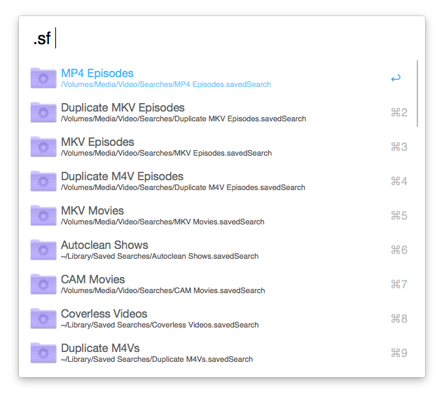

# Smart Folders for Alfred #

Quick access to your Smart Folders in [Alfred 2 ](http://www.alfredapp.com/).

## Usage ##

* Type **.sf** to see a list of your Smart Folders.
* Type **.sf [start of folder name]** to narrow the results.
* `TAB` or `ENTER` on a Smart Folder to view its contents.
* Continue typing to filter the contents of the current folder.
* `ENTER` will open a file/folder in its default app.
* `⌘+ENTER` will reveal the item in the Finder.
* Type **.sfhelp** to view the help file.

## Slightly more advanced usage ##

You can also set up keywords to go directly to the contents of a specific Smart Folder.

See the included help file for more details (keyword **.sfhelp** to view it).

## Third-party software, copyright etc. ##

* All the code I wrote is public domain. Have at it.
* [docopt](http://docopt.org/) is covered by the MIT licence.
* I don't know what licensing [alfred.py](https://github.com/nikipore/alfred-python) uses.