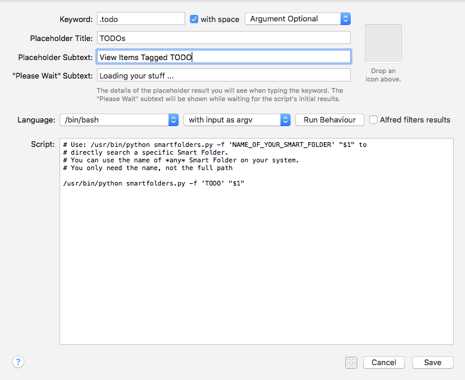

title: Smart Folders for Alfred Help
author: Dean Jackson <deanishe@deanishe.net>
date: 2013-10-29

# Smart Folders for Alfred Help #

Browse your Saved Searches in Alfred 2.

## Usage ##

* Type **.sf** to see a list of your Smart Folders (Saved Searches).
* Type **.sf [part of folder name]** to narrow the results.
* `ENTER` on a Smart Folder to open it in Finder.
* `TAB` on a Smart Folder to view its contents.
* Continue typing to filter the contents of the current folder.
* `ENTER` will open a file/folder in its default app.
* `⌘+ENTER` will reveal the item in the Finder.

### Custom searches ###

You can also set up keywords to go directly to the contents of a specific Smart Folder. To do this, add a script filter in the Workflow's configuration using the same settings as the default **.sf** one.

Enter the following as the script:

    python smartfolders.py -f 'FOLDER_NAME' "{query}"

where `FOLDER_NAME` is the name of the Saved Search whose contents you want to search.

It should look something like this:

The above example is included in the workflow, but has no keyword.

## Third-party software, copyright etc. ##

* All my code is covered by the [MIT licence](http://opensource.org/licenses/MIT).
* [docopt](http://docopt.org/) is covered by the [MIT licence](http://opensource.org/licenses/MIT).
* I don't know what licensing [alfred.py](https://github.com/nikipore/alfred-python) uses.

## More Info ##

Smart Folders for Alfred is hosted on [GitHub](https://github.com/deanishe/alfred-smartfolders).

Feedback to <deanishe@deanishe.net>
